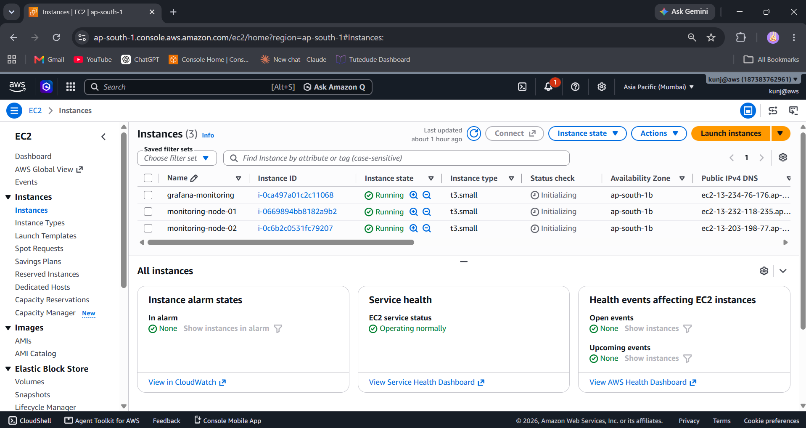
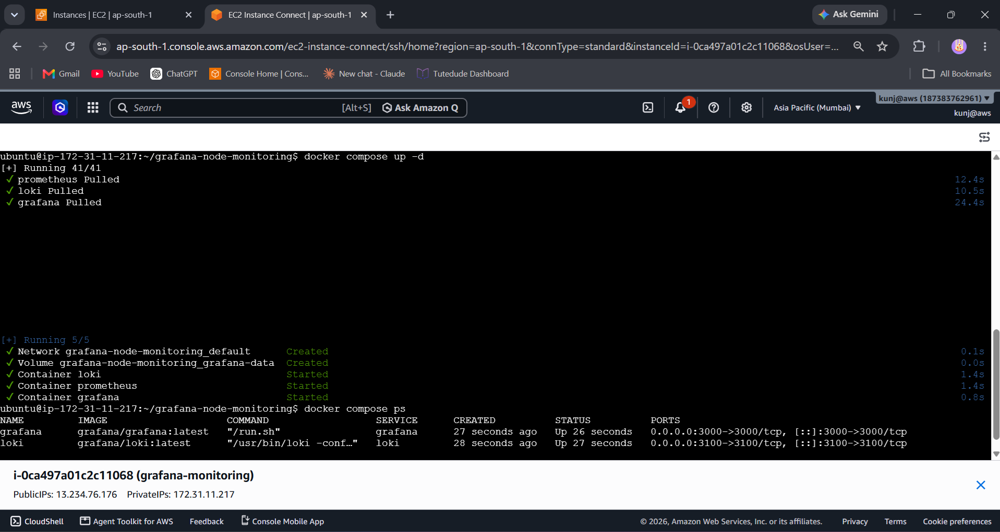
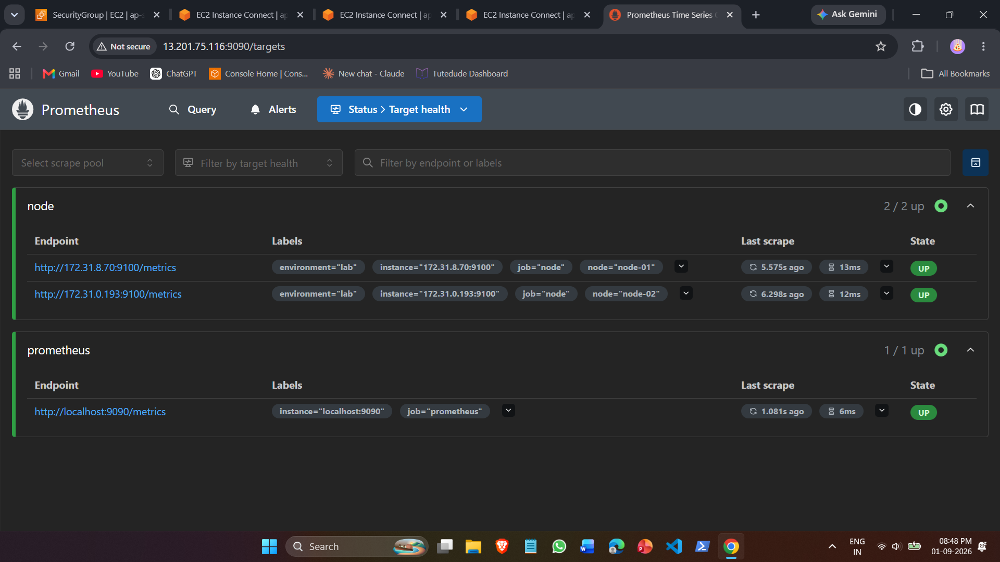
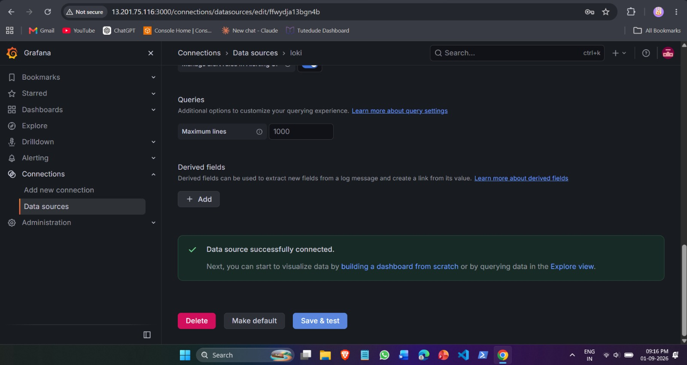
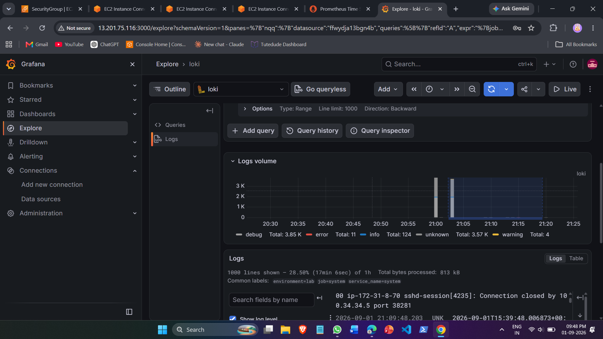
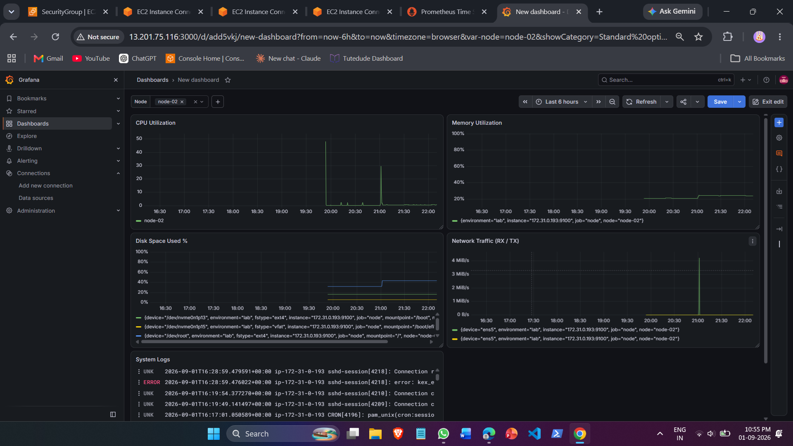
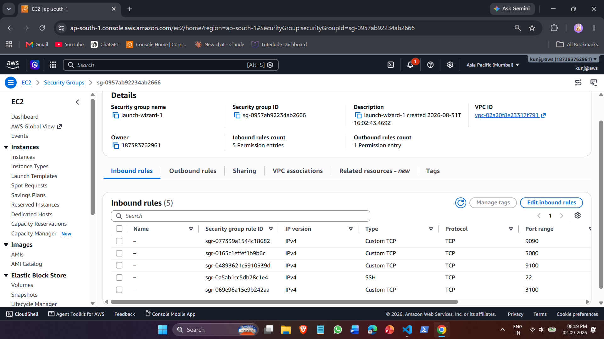

# Standard Multi-Node Linux Monitoring & Observability Stack

A standardized, production-ready monitoring and centralized logging solution built with **Prometheus**, **Grafana Loki**, **Grafana Alloy**, **Node Exporter**, and **Grafana**.

Designed to dynamically track host metrics (CPU, Memory, Disk, Network) and aggregate system logs across multiple Linux compute instances from a unified dashboard.

---

## 🏛️ Architecture Overview

```text
                               AWS Cloud / VPC
                                      │
                 ┌────────────────────┴────────────────────┐
                 │                                         │
        Monitoring Server                          Monitored Nodes
        (Docker Compose)                     ┌─────────────┴─────────────┐
                 │                           │                           │
          ┌──────────────┐                Node-01                     Node-02
          │   Grafana    │                   │                           │
          │  (Port 3000) │             Node Exporter               Node Exporter
          └──────┬───────┘              (Port 9100)                 (Port 9100)
                 │                           ▲                           ▲
                 ├───────────────────────────┤ (Prometheus Scrapes)      │
          ┌──────┴───────┐                   │                           │
          │  Prometheus  │───────────────────┴───────────────────────────┘
          │  (Port 9090) │
          └──────────────┘
          ┌──────────────┐                   ┌───────────────────────────┐
          │     Loki     │◄──────────────────┤       Grafana Alloy       │
          │  (Port 3100) │  (Pushes Logs)    │   (/var/log/*.log Stream) │
          └──────────────┘                   └───────────────────────────┘
```

* **Metrics Scrape Pipeline:** `node_exporter` runs as a systemd service on each node, exposing metrics at `:9100/metrics`. Prometheus scrapes these endpoints over the private VPC subnet at 15-second intervals.
* **Log Ingestion Pipeline:** `Grafana Alloy` tails `/var/log/*.log` on each node, attaches static metadata labels (`node`, `job`, `environment`), and forwards the streams over HTTP to Loki on port `3100`.
* **Central Visualization:** A single Grafana dashboard utilizes PromQL and LogQL parameterized with dynamic variable filtering (`$node`) to inspect all nodes seamlessly.

---

## 📁 Repository Structure

```text
Grafana dashboard creation/
├── docker-compose.yml
├── README.md
├── prometheus/
│   └── prometheus.yml
├── loki/
│   └── loki-config.yml
├── alloy/
│   └── config.alloy
├── grafana/
│   └── dashboards/
│       └── node-monitoring.json
└── screenshots/
    ├── 01-aws-instances.png
    ├── 02-monitoring-stack-running.png
    ├── 03-prometheus-targets-up.png
    ├── 04-grafana-datasources-connected.png
    ├── 05-loki-logs-explore.png
    ├── 06-standard-node-dashboard.png
    ├── 07-node-02-switch.png
    └── 08-aws-security-group-rules.png
```

---

## ⚙️ Prerequisites & Network Requirements

### Port Matrix

| Service | Port | Direction | Source / Purpose |
| :--- | :--- | :--- | :--- |
| **Grafana** | `3000` | Inbound | Web UI Access (Public/VPN) |
| **Prometheus** | `9090` | Inbound | Monitoring Server / Web UI |
| **Loki** | `3100` | Inbound | Receives log streams from Alloy agents |
| **Node Exporter** | `9100` | Inbound | Scraped by Prometheus Server via Private IP |
| **SSH** | `22` | Inbound | Host administration |

---

## 🚀 Step-by-Step Deployment Guide

### Phase 1: Deploy Monitoring Server (Central Hub)

1. Clone the repository on the Monitoring Host:
   ```bash
   git clone [https://github.com/](https://github.com/)<your-username>/Grafana-dashboard-creation.git
   cd "Grafana dashboard creation"
   ```

2. Configure target private IPs in `prometheus/prometheus.yml`:
   ```yaml
   global:
     scrape_interval: 15s

   scrape_configs:
     - job_name: "prometheus"
       static_configs:
         - targets: ["localhost:9090"]

     - job_name: "node"
       static_configs:
         - targets: ["172.31.8.70:9100"]
           labels:
             node: "node-01"
             environment: "lab"
         - targets: ["172.31.0.193:9100"]
           labels:
             node: "node-02"
             environment: "lab"
   ```

3. Launch the containerized monitoring stack:
   ```bash
   docker compose up -d
   ```

4. Verify services are healthy:
   ```bash
   docker compose ps
   ```

---

### Phase 2: Configure Monitored Nodes (Agent Setup)

Execute the following commands on every Linux node to be monitored (`node-01`, `node-02`, etc.):

#### 1. Install & Configure Node Exporter

```bash
cd /tmp
wget [https://github.com/prometheus/node_exporter/releases/download/v1.8.2/node_exporter-1.8.2.linux-amd64.tar.gz](https://github.com/prometheus/node_exporter/releases/download/v1.8.2/node_exporter-1.8.2.linux-amd64.tar.gz)
tar xvfz node_exporter-1.8.2.linux-amd64.tar.gz
sudo mv node_exporter-1.8.2.linux-amd64/node_exporter /usr/local/bin/
sudo useradd -rs /bin/false node_exporter

sudo tee /etc/systemd/system/node_exporter.service << 'EOF'
[Unit]
Description=Node Exporter
After=network.target

[Service]
User=node_exporter
Group=node_exporter
Type=simple
ExecStart=/usr/local/bin/node_exporter

[Install]
WantedBy=multi-user.target
EOF

sudo systemctl daemon-reload
sudo systemctl enable --now node_exporter
```

#### 2. Install & Configure Grafana Alloy

```bash
# Add Grafana repository key
sudo mkdir -p /etc/apt/keyrings/
wget -q -O - [https://apt.grafana.com/gpg.key](https://apt.grafana.com/gpg.key) | gpg --dearmor | sudo tee /etc/apt/keyrings/grafana.gpg > /dev/null
echo "deb [signed-by=/etc/apt/keyrings/grafana.gpg] [https://apt.grafana.com](https://apt.grafana.com) stable main" | sudo tee /etc/apt/sources.list.d/grafana.list

# Install Alloy package
sudo apt update -y && sudo apt install -y alloy

# Write configuration file (Update <NODE_NAME> and <MONITORING_SERVER_PRIVATE_IP>)
sudo tee /etc/alloy/config.alloy << 'EOF'
local.file_match "system_logs" {
  path_targets = [
    {__path__ = "/var/log/*.log", node = "node-01", job = "system", environment = "lab"},
  ]
}

loki.source.file "log_scraper" {
  targets    = local.file_match.system_logs.targets
  forward_to = [loki.write.endpoint.receiver]
}

loki.write "endpoint" {
  endpoint {
    url = "http://<MONITORING_SERVER_PRIVATE_IP>:3100/loki/api/v1/push"
  }
}
EOF

# Grant log read access and start Alloy service
sudo usermod -aG adm,systemd-journal alloy
sudo systemctl enable --now alloy
```

---

## 📊 Standard PromQL & LogQL Telemetry Queries

The unified Grafana dashboard runs the following production queries:

* **CPU Utilization (%):**
  ```promql
  100 - (avg by (node) (rate(node_cpu_seconds_total{mode="idle", node=~"$node"}[$__rate_interval])) * 100)
  ```

* **Memory Utilization (%):**
  ```promql
  (1 - (node_memory_MemAvailable_bytes{node=~"$node"} / node_memory_MemTotal_bytes{node=~"$node"})) * 100
  ```

* **Disk Utilization (%):**
  ```promql
  100 - ((node_filesystem_avail_bytes{node=~"$node", fstype!~"tmpfs|overlay"} / node_filesystem_size_bytes{node=~"$node", fstype!~"tmpfs|overlay"}) * 100)
  ```

* **Network I/O Throughput (Bytes/sec):**
  ```promql
  # Inbound Rate (RX)
  rate(node_network_receive_bytes_total{node=~"$node", device!~"lo"}[$__rate_interval])

  # Outbound Rate (TX)
  rate(node_network_transmit_bytes_total{node=~"$node", device!~"lo"}[$__rate_interval])
  ```

* **Live System Logs (Loki):**
  ```logql
  {job="system", node=~"$node"}
  ```

---

## 🔄 Node Onboarding Runbook (Adding New Nodes)

To add additional compute instances (e.g., `node-03`) without modifying the Grafana dashboard:

1. **Deploy Agents:** Follow [Phase 2: Configure Monitored Nodes](#phase-2-configure-monitored-nodes-agent-setup) on the new host, setting `node = "node-03"` in `/etc/alloy/config.alloy`.
2. **Update Prometheus Target:** Append the target block in `prometheus/prometheus.yml`:
   ```yaml
   - targets: ["<NODE_03_PRIVATE_IP>:9100"]
     labels:
       node: "node-03"
       environment: "lab"
   ```
3. **Reload Prometheus:**
   ```bash
   docker compose restart prometheus
   ```
4. **Auto-Discovery:** The `$node` variable in Grafana will automatically detect `node-03`, making its telemetry and logs immediately accessible from the top dropdown.

---

## 🛠️ Verification & Troubleshooting

* **Prometheus Targets Status:** Navigate to `http://<SERVER_PUBLIC_IP>:9090/targets` to verify all nodes report `UP (1/1)`.
* **Loki Ingestion Status:** Open Grafana $\rightarrow$ **Explore** $\rightarrow$ Select `Loki` data source $\rightarrow$ Run `{job="system"}` to view incoming streams.
* **Agent Diagnostics:**
  ```bash
  sudo systemctl status node_exporter --no-pager
  sudo systemctl status alloy --no-pager
  journalctl -u alloy -e --no-pager
  ```

---

## 📸 Implementation Proofs

| Description | Evidence |
| :--- | :--- |
| **AWS EC2 Infrastructure** |  |
| **Docker Compose Monitoring Stack** |  |
| **Prometheus Active Scrape Targets** |  |
| **Grafana Data Source Validation** |  |
| **Loki Centralized Log Ingestion** |  |
| **Standardized Node Dashboard (`node-01`)** |  |
| **Dynamic Multi-Node Switching (`node-02`)** |  |
| **Security Group Inbound Port Rules** |  |